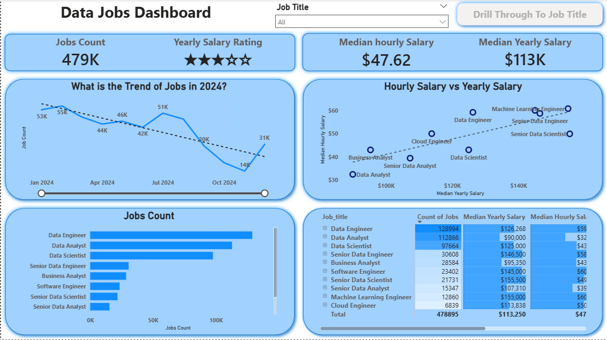
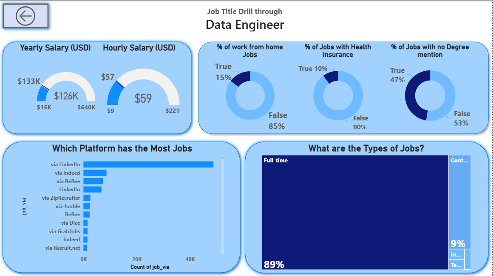

# Data Jobs Dashboard - Power BI



---

## Problem Statement

The overall volume of data job opportunities declined through 2024, even as the market began stabilizing - but the picture varied sharply by role. There was particular demand for experienced professionals in specialized positions, while generalist roles faced more pressure. For anyone navigating this market - whether entering, transitioning, or repositioning - the information needed to make that call was scattered across platforms with no single coherent view. This dashboard consolidates ~479K 2024 job postings into one place: which roles are hiring, what they pay, and what the actual working conditions look like per title.

---

## Dataset

- **Source:** Real-world 2024 data science job postings
- **Coverage:** Job titles, hourly and yearly salaries, job type, platforms, work-from-home status, health insurance, degree requirements, and location
- **Scale:** ~479,000 job postings across 10 role categories

---

## Tools & Skills Applied

| Area | What I Did |
|---|---|
| **Data Transformation (Power Query)** | Resolved null values in salary fields and corrected inconsistent formatting across hourly and yearly compensation columns before the data was usable for any measure |
| **DAX Measures** | Built measures for Median Yearly Salary, Median Hourly Salary, Job Count, and percentage-based KPIs |
| **Visualizations** | Bar charts, line charts, scatter plots, donut charts, gauge charts, and tables |
| **Drill-Through Configuration** | Built cross-page drill-through from the market overview to a role-specific detail page - required precise filter context management so each title landed on accurate, isolated data |
| **Interactivity** | Slicers for job title filtering, bookmarks and buttons for UX flow |
| **Dashboard Design** | Two-page layout - summary view and a detailed drill-through page per job title |

---

## Dashboard Walkthrough

### Page 1 - Market Overview 

 

The entry point. Shows total job count (479K), median hourly salary ($47.62), and median yearly salary ($113K) at a glance. A line chart tracks monthly job postings through 2024 - volume peaked early in the year and declined sharply toward Q4. A scatter plot maps hourly vs. yearly salary across roles, and a table breaks down count and compensation per job title.

### Page 2 - Job Title Drill-Through 

 

Accessed by selecting a job title from Page 1. Drills down to role-specific detail: salary range (min, median, max), work-from-home percentage, health insurance availability, degree requirement, top hiring platforms, and job type breakdown. The Data Engineer view, for example, shows a median yearly salary of $126K with 85% of roles being on-site and only 10% offering health insurance.

---

## Key Insights

1. **Data Engineer leads in volume and pays well** - 129K postings at a $126K median yearly salary. Data Engineer roles showed resilience in 2024 even as broader data job openings declined, which likely explains why it dominates this dataset.

2. **ML Engineer and Senior Data Scientist top compensation at $155K** - despite only 12K-22K postings compared to Data Engineer's 129K. Companies are paying a premium for AI-adjacent skills specifically, reflected in high compensation despite lower hiring volume.

3. **Data Analyst is the highest-volume entry point but carries the lowest salary** - 113K postings, $90K median. High supply, lower leverage. The gap between Analyst and Engineer compensation ($36K) is large enough that a transition between those roles has real financial weight.

4. **Postings dropped from 55K in January to 14K in October** - a 75% decline over 10 months. This aligns with the broader contraction in data role postings documented across 2024, not a dataset anomaly.

5. **89% full-time, 85% on-site for Data Engineers** - the remote-work narrative in tech does not hold for this role at this level. If you're targeting Data Engineer roles, on-site is the default assumption, not the exception.

6. **LinkedIn dominates hiring activity** - significantly ahead of all other platforms. Being absent from LinkedIn is a structural disadvantage regardless of skill level.

---

## Repository Structure

```
├── Data_Jobs_Dashboard.pbix   # Power BI report file
├── data/
│   └── data_jobs_2024.csv     # Raw dataset
├── resources/
│   └── images/                # Screenshots and previews
└── README.md
```

---

## How to Use

Open [`Data_Jobs_Dashboard.pbix'](/Data_Jobs_Dashboard.pbix) in Power BI Desktop. Use the **Job Title** slicer on Page 1 to filter by role, then click **Drill Through to Job Title** to navigate to the detailed view for that role.
